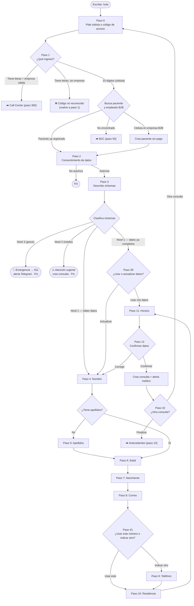
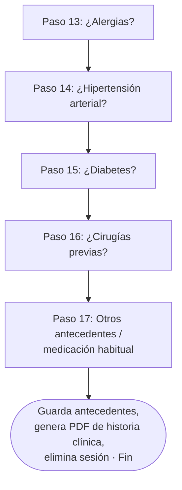
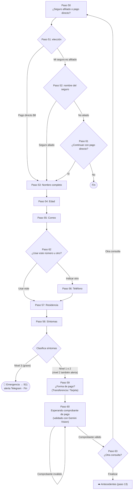
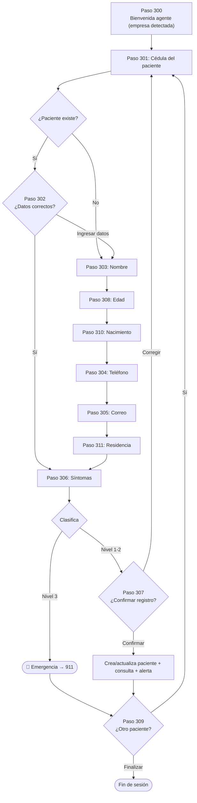
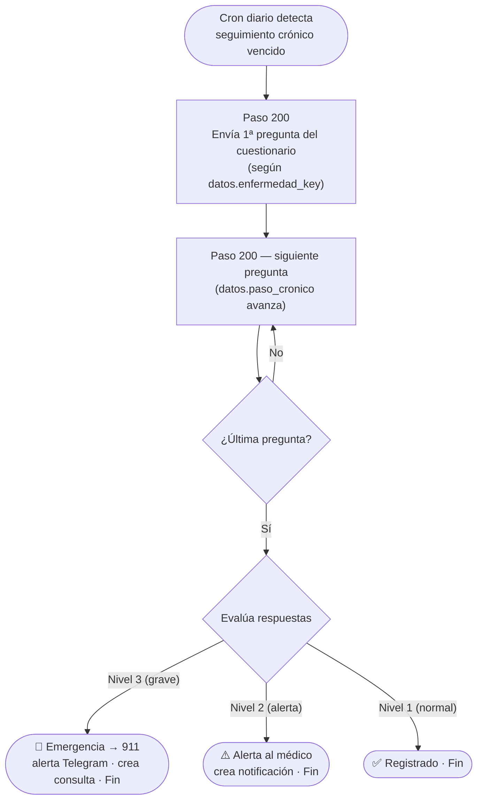
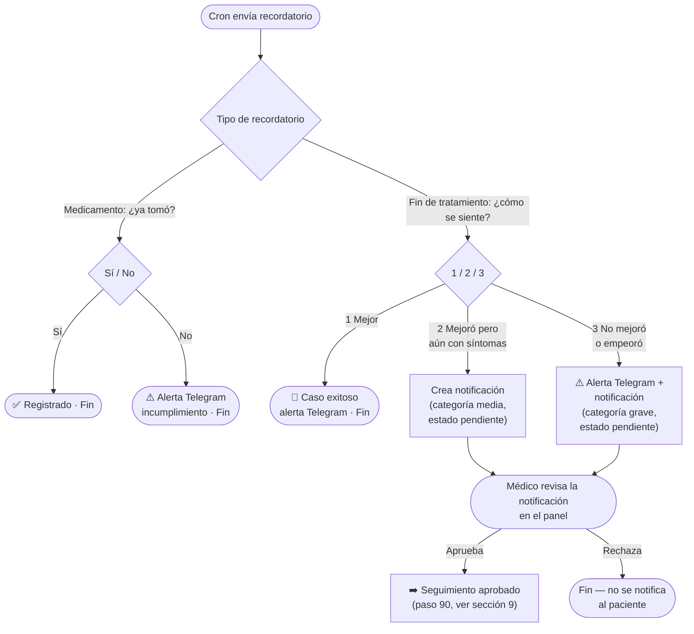
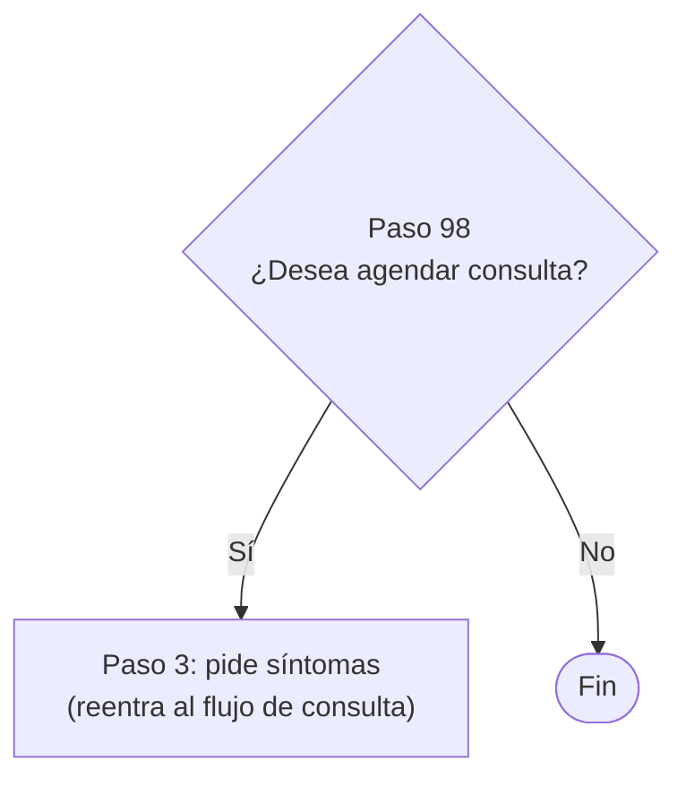
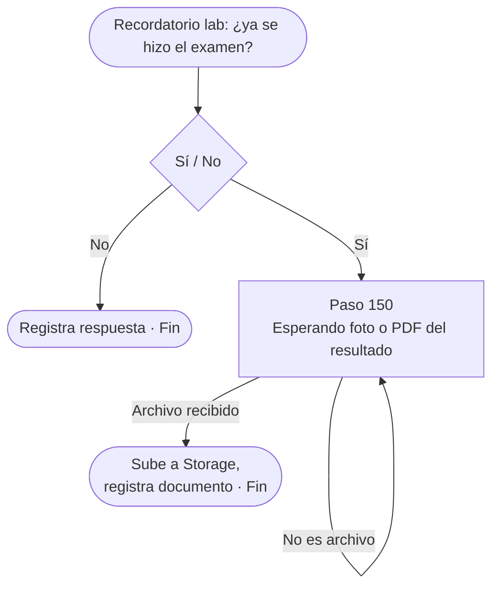
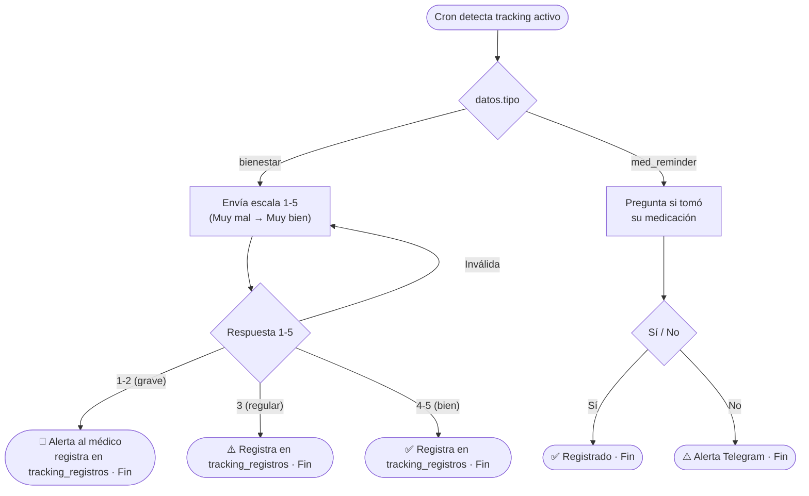
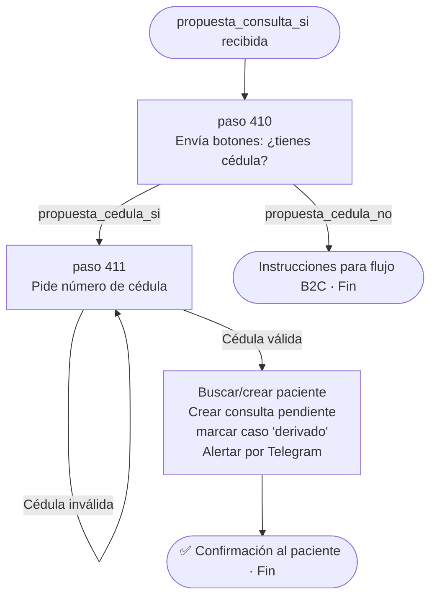

# 🤖 Flujos del bot de WhatsApp — MediLyft

> **Cómo ver esto como diagramas:** los bloques ` ```mermaid ` se renderizan solos en
> GitHub y en VS Code (extensión *Markdown Preview Mermaid Support*). Para editar visual,
> pegá un bloque en **https://mermaid.live**. Para modificar un flujo: editá el texto del
> diagrama (las flechas `-->` y los nodos) y listo.
>
> Este documento es la **fuente de verdad legible** de los flujos. Si cambiás el código,
> actualizá acá; si querés proponer un cambio, editá acá y lo implementamos.

---

## 🗺️ Mapa de ruteo (cómo el webhook decide qué flujo corre)

El bot guarda en cada sesión un número de **`paso`**. `api/webhook.js` mira ese número y
deriva al flujo correspondiente **por rangos** (sistema legacy, ver sección *"Plan de
migración"*):

| Rango de `paso` | Flujo | Archivo |
|---|---|---|
| `0`–`12`, `39`, `41`, `42` | Consulta principal (registro paciente) | `flujo-consulta.js` |
| `13`–`17` | Antecedentes médicos | `flujo-antecedentes.js` |
| `50`–`63` | B2C (pago directo / seguro externo) | `flujo-b2c.js` |
| `90`–`97` | Seguimiento aprobado por médico (pago) | `flujo-seguimiento-pago.js` |
| `98` | Reagendar | `flujo-reagendar.js` |
| `99` | ⚰️ **CÓDIGO MUERTO** — ver nota abajo | `webhook.js` |
| `150` | Subida de resultado de examen de laboratorio | `flujo-seguimiento-laboratorio.js` |
| `200` | Enfermedades crónicas (cuestionarios) | `flujo-cronicas.js` |
| `300`–`311` | Call center B2B (agente registra pacientes) | `flujo-callcenter.js` |
| `400` | Tracking externo (bienestar + medicación) | `flujo-tracking.js` |
| `410`–`411` | Migración tracking → consulta (`_flujo:'tracking_migracion'`) | `flujo-tracking-consulta.js` |
| (sin paso) | Respuesta a recordatorio de seguimiento | `flujo-seguimiento.js` |

> ℹ️ **Detalle de ruteo (dos capas):** `webhook.js` despacha los rangos `13-17`, `98`,
> `150`, `200`, `300+`, `400+` directamente. Los pasos `0-12`, `39`, `41`, `42` y `50-97`
> caen en `procesarPaso()` de `flujo-consulta.js`, que a su vez delega internamente:
> `50-89` → `flujo-b2c.js` y `90-97` → `flujo-seguimiento-pago.js`.
> Esta delegación oculta se elimina en la Fase 2 de la migración.

> ⚰️ **Paso 99 — código muerto:** la rama `paso === 99` en `webhook.js` nunca se alcanza.
> `flujo-antecedentes.js` termina con `eliminar(telefono)` — la sesión se borra por
> completo, nunca queda en `paso: 99`. Si en algún momento se quiere mostrar un mensaje
> de "ya registrado", debe dispararse desde el flujo que corresponda.

> ℹ️ **Crónicas y tracking no escalan su `paso`:** `flujo-cronicas.js` siempre guarda
> `paso: 200` (fijo) y usa `datos.paso_cronico` como sub-estado interno. Ídem
> `flujo-tracking.js` con `paso: 400` y `datos.tipo`. Esto los inmuniza contra colisiones
> dentro de sus propios rangos.

> ⚠️ **La numeración por rangos sigue siendo el punto más frágil del sistema** — ver
> la sección *"Plan de migración"* al final. Agregar un paso con el número equivocado
> lo roba silenciosamente otro flujo.

---

## 1) 🏥 Flujo de consulta principal

Es la puerta de entrada. El paciente escribe **hola** y registra una teleconsulta.



---

## 2) 📋 Antecedentes médicos (pasos 13–17)

Después de confirmar la consulta, el bot completa la historia clínica.



---

## 3) 💳 Flujo B2C — pago directo / seguro externo (pasos 50–63)

Cuando la cédula **no** está en ninguna empresa afiliada.



> ℹ️ El flujo B2C **no tiene paso de horario de preferencia** (a diferencia de la
> consulta principal/B2B, que sí lo pide en el paso 11). De síntomas (P58) se pasa
> directo a forma de pago (P59).

---

## 4) 🏢 Call Center B2B (pasos 300–311)

Un agente autenticado con el **código de empresa** registra varios pacientes seguidos.



---

## 5) 🩺 Enfermedades crónicas (paso 200 — sub-estado en datos)

El cron diario (`api/cron.js`) inicia el cuestionario; el paciente responde por número.
El `paso` de sesión siempre es **200** (fijo). El progreso interno se lleva en
`datos.paso_cronico` (contador de pregunta) y `datos.enfermedad_key`.



Enfermedades actualmente soportadas: hipertensión, diabetes tipo 1 y 2, EPOC, asma,
insuficiencia cardíaca, enfermedad renal, tiroides, artritis reumatoide, lupus,
epilepsia, post-ACV, fibrilación auricular, depresión, obesidad, osteoporosis, VIH.

---

## 6) 🔔 Respuestas a recordatorios de seguimiento

No usa `paso`: cuando hay un recordatorio pendiente (medicamento o fin de tratamiento),
la respuesta del paciente se procesa aparte (`flujo-seguimiento.js`), antes de llegar
al ruteo por `paso`.



> ⚠️ **Las respuestas "2" y "3" NO redirigen automáticamente a "Reagendar" (paso 98).**
> Solo crean una notificación/alerta para que un médico la revise manualmente desde el
> panel. Si el médico la aprueba, recién ahí `api/seguimiento-decision.js` arranca una
> sesión nueva en `paso: 90` (sección 9) — distinto del paso 98 de "Reagendar".

---

## 7) 📅 Reagendar (paso 98)



---

## 8) 🧪 Subida de examen de laboratorio (paso 150)

Se llega aquí cuando el paciente responde **"Sí"** al recordatorio de seguimiento de
laboratorio (`flujo-seguimiento-laboratorio.js`). Ese handler crea la sesión con
`paso: 150` y le pide la foto/PDF del resultado.



---

## 9) 🔁 Consulta de seguimiento aprobada por el médico (pasos 90–97)

No se llega aquí escribiendo "hola". Cuando un médico **aprueba** una notificación de
seguimiento (sección 6) desde el panel, `api/seguimiento-decision.js`:

1. Marca la notificación como `aprobada`.
2. Pre-carga `datos` con la info ya conocida del paciente (nombre, cédula, correo,
   teléfono, lugar de residencia, `cliente_b2b_id` si aplica, `consulta_origen_id`).
3. Crea una sesión en **`paso: 90`** y le envía al paciente botones preguntando si
   desea agendar la consulta de control.

```mermaid
flowchart TD
  APROB(["Médico aprueba seguimiento\nen el panel (api/seguimiento-decision.js)"]) --> SETUP["Crea sesión en paso 90\ncon correo / teléfono / residencia\nprecargados desde el paciente"]
  SETUP --> P90{"Paso 90\n¿Desea agendar consulta de control?"}
  P90 -->|"No"| FIN90([Elimina sesión · Fin])
  P90 -->|"Sí"| P91["Paso 91\n¿Cómo se siente?\n(describe síntomas)"]

  P91 --> NIVs{"Clasifica síntomas"}
  NIVs -->|"Nivel 3 (grave)"| EMERs([🚨 Emergencia → 911\nalerta Telegram · Fin])
  NIVs -->|"Nivel 1 o 2"| DATOS{"¿Falta correo,\nteléfono o residencia?"}

  DATOS -->|"Falta correo"| P92["Paso 92: Correo"] --> DATOS
  DATOS -->|"Falta teléfono"| P93["Paso 93: Teléfono de contacto"] --> DATOS
  DATOS -->|"Falta residencia"| P94["Paso 94: Lugar de residencia"] --> DATOS
  DATOS -->|"Completos"| PAGO{"¿Tiene cliente_b2b_id\n(empresa cubre)?"}

  PAGO -->|"Sí — sin costo"| REGB2B([Crea consulta de seguimiento\nsin costo · alerta · Fin])
  PAGO -->|"No — $8.00"| P95["Paso 95\n¿Forma de pago?\n(Transferencia / Tarjeta)"]
  P95 --> P96["Paso 96\nEsperando comprobante de pago"]
  P96 --> REGPAGO([Crea consulta + facturación\n(facturacion_b2c) · Fin])
```

> ℹ️ En la práctica, `seguimiento-decision.js` ya pre-carga correo, teléfono y lugar
> de residencia desde el registro del paciente, así que P92-94 normalmente se saltan.

---

## 10) 📡 Tracking externo (paso 400 — sub-estado en datos)

El cron de tracking (`api/cron.js`) crea la sesión con `paso: 400` y `datos.tipo` para
indicar el tipo de interacción. El `paso` siempre es **400** (fijo).



> ℹ️ El flujo de tracking se activa la primera vez que el paciente escribe **hola** y
> tiene un `tracking_casos` activo. El webhook detecta esto antes de crear una sesión
> normal y setea `paso: 400` directamente.
>
> Si el paciente **ya estaba activado** y vuelve a escribir **hola**, el webhook muestra
> dos botones de elección: `tracking_reporte` (reporte de seguimiento) o
> `tracking_consulta` (iniciar flujo de consulta MediLyft normal).

---

## 11) 🔄 Migración tracking → consulta (`tracking_migracion`, pasos 410–411)

Flujo activado cuando el médico propone una consulta MediLyft a un paciente de tracking.
Implementado en `src/flows/flujo-tracking-consulta.js`.

### Fase 1 — Doctor propone (panel)
El doctor abre el detalle de un caso en el panel, ve el botón **"📋 Proponer consulta"**
(visible cuando `estado='activo'` + `activado=true` + último bienestar ≥ 4) y hace click.
El panel hace `PATCH tracking_casos { propuesta_pendiente: true }`.

### Fase 2 — Cron envía propuesta
El cron detecta `propuesta_pendiente=true` y envía al paciente botones de WhatsApp:
- `propuesta_consulta_si` → "✅ Sí, me interesa"
- `propuesta_consulta_no` → "❌ No por ahora"

Luego marca `propuesta_pendiente: false, propuesta_enviada_at: now()`.

### Fase 3 — Webhook maneja respuesta
```
propuesta_consulta_si → guardar sesión en paso 410 con _flujo:'tracking_migracion'
                        → enviar botones ¿tienes cédula?
propuesta_consulta_no → mensaje de cierre, sesión termina
```

### Fase 4 — Mini-flujo `tracking_migracion` (pasos 410–411)


**Tabla de ruteo:**

| `_flujo` | Pasos | Archivo |
|---|---|---|
| `tracking_migracion` | 410–411 | `flujo-tracking-consulta.js` |

**Columnas nuevas en `tracking_casos`:**
```sql
propuesta_pendiente  BOOLEAN    DEFAULT false
propuesta_enviada_at TIMESTAMPTZ DEFAULT NULL
```

---

## 🗓️ Plan de migración — sistema de pasos nombrados

### Problema raíz

El `paso` es un entero en un **namespace global y plano** compartido por los 10 flujos.
Cualquier número que se elija puede colisionar con otro flujo. Agregar un paso con el
número equivocado lo roba silenciosamente otro handler y la sesión se rompe sin error.

### Solución

Agregar un campo `_flujo` (string) en la sesión. El webhook routea por **nombre de
flujo**, no por rango numérico. Cada flujo usa su propio espacio de pasos internos.

**Estado actual de la sesión:**
```json
{ "paso": 41, "datos": { "cedula": "...", ... } }
```

**Estado objetivo:**
```json
{ "paso": 41, "datos": { "_flujo": "consulta", "cedula": "...", ... } }
```

> ℹ️ `_flujo` se guarda dentro de `datos` (no como columna separada) para no requerir
> cambio de esquema en Supabase. El prefijo `_` lo distingue de datos de negocio.

---

### Fase 0 — Corrección de documentación ✅ COMPLETADA

- Actualizar `flujo-bot.md` con pasos 42, 63, 150, 400 faltantes
- Marcar paso 99 como código muerto
- Corregir rango B2C de `50-62` a `50-63`
- Documentar el plan de migración

---

### Fase 1 — Infraestructura (plomería) ✅ COMPLETADA

**Archivos modificados:**
- `src/services/sesiones.js` — `guardar(telefono, paso, datos, flujo = null)` acepta
  el nombre del flujo y lo embebe en `datos._flujo`
- `api/webhook.js` — extrae `flujo = datos._flujo` y agrega el bloque de ruteo
  nombrado (`if (flujo) { ... }`) antes del ruteo legacy numérico

**Comportamiento:** sin cambio. Ningún flujo setea `_flujo` todavía; el bloque nuevo
nunca se ejecuta. Es solo scaffolding para la Fase 2.

---

### Fase 2 — Migrar flujos ✅ COMPLETADA

Patrón de migración por flujo:

1. En el flow, al llamar `guardar()`, pasar el nombre: `guardar(tel, paso, datos, 'nombre')`
2. En `webhook.js`, agregar el `case 'nombre':` en el bloque `if (flujo)`
3. Eliminar el `if (paso >= X)` legacy correspondiente
4. Eliminar la delegación oculta de `flujo-consulta` si aplica

| Orden | Flujo | `_flujo` | Pasos actuales | Complejidad |
|---|---|---|---|---|
| 1 | Tracking | `'tracking'` | 400 | Mínima — 1 paso fijo |
| 2 | Reagendar | `'reagendar'` | 98 | Mínima — 1 paso |
| 3 | Laboratorio | `'laboratorio'` | 150 | Baja — 1 paso |
| 4 | Antecedentes | `'antecedentes'` | 13–17 | Baja — lineal |
| 5 | Call Center | `'callcenter'` | 300–311 | Media |
| 6 | Crónicas | `'cronicas'` | 200 | Media (ya usa sub-estado) |
| 7 | B2C | `'b2c'` | 50–63 | Media + remover delegación |
| 8 | Seguimiento pago | `'seguimiento_pago'` | 90–97 | Media + remover delegación |
| 9 | Consulta | `'consulta'` | 0–12, 39, 41, 42 | Alta — el más complejo |

---

### Fase 3 — Limpieza final (después de migrar todos los flujos)

- Eliminar todos los `if (paso >= X)` de rangos numéricos en `webhook.js`
- Eliminar la lista `PASOS_VALIDOS` de `flujo-consulta.js`
- Eliminar la sub-delegación `flujo-consulta → flujo-b2c` y `flujo-consulta → flujo-seguimiento-pago`
- Eliminar la rama muerta `paso === 99` de `webhook.js`
- El webhook queda con un `switch (flujo)` limpio y sin números hardcodeados
