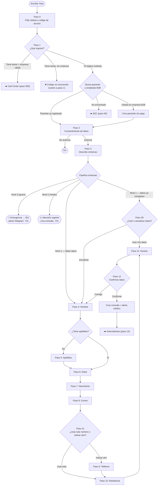
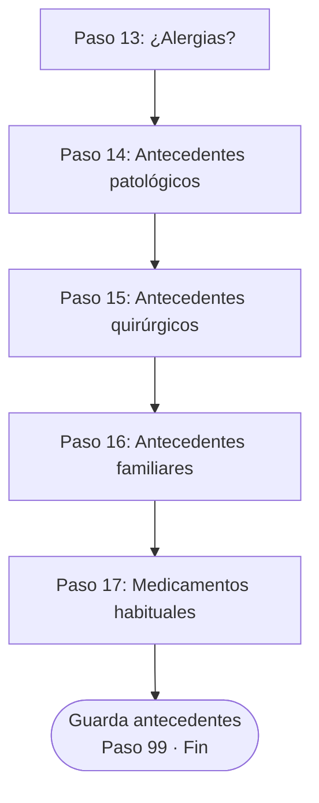
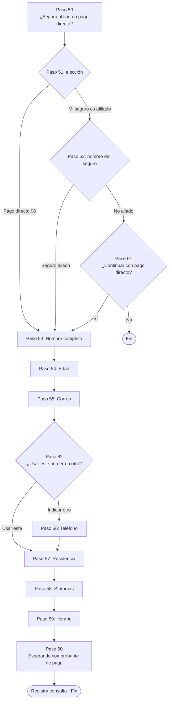
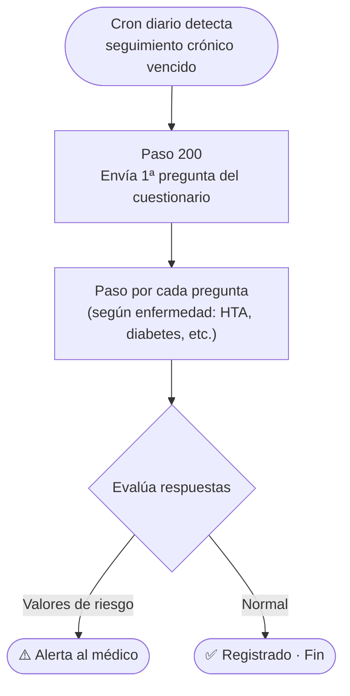
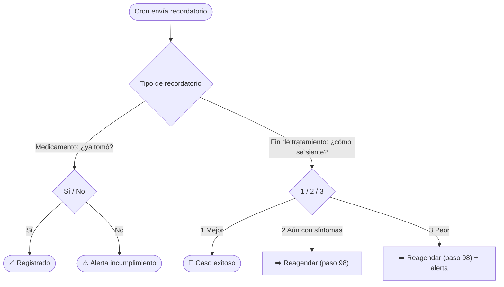

# 🤖 Flujos del bot de WhatsApp — MediLyft

> **Cómo ver esto como diagramas:** los bloques ` ```mermaid ` se renderizan solos en
> GitHub y en VS Code (extensión *Markdown Preview Mermaid Support*). Para editar visual,
> pegá un bloque en **https://mermaid.live**. Para modificar un flujo: editá el texto del
> diagrama (las flechas `-->` y los nodos) y listo.
>
> Este documento es la **fuente de verdad legible** de los flujos. Si cambiás el código,
> actualizá acá; si querés proponer un cambio, editá acá y lo implementamos.

---

## 🗺️ Mapa de ruteo (cómo el webhook decide qué flujo corre)

El bot guarda en cada sesión un número de **`paso`**. `api/webhook.js` mira ese número y
deriva al flujo correspondiente **por rangos**:

| Rango de `paso` | Flujo | Archivo |
|---|---|---|
| `0`–`12`, `39`, `41` | Consulta principal (registro paciente) | `flujo-consulta.js` |
| `13`–`17` | Antecedentes médicos | `flujo-antecedentes.js` |
| `50`–`62` | B2C (pago directo / seguro externo) | `flujo-b2c.js` |
| `98` | Reagendar | `flujo-reagendar.js` |
| `99` | "Ya registrado" (mensaje fijo) | `webhook.js` |
| `200`+ | Enfermedades crónicas (cuestionarios) | `flujo-cronicas.js` |
| `300`+ | Call center B2B (agente registra pacientes) | `flujo-callcenter.js` |
| (sin paso) | Respuesta a recordatorio de seguimiento | `flujo-seguimiento.js` |

> ⚠️ **Esta numeración por rangos es la parte frágil del sistema** — ver la sección
> *"Deuda técnica"* al final. Ya causó varios bugs (pasos que caían en el rango de otro
> flujo). Al agregar un paso nuevo, mantenelo **dentro del rango de su flujo**.

---

## 1) 🏥 Flujo de consulta principal

Es la puerta de entrada. El paciente escribe **hola** y registra una teleconsulta.



---

## 2) 📋 Antecedentes médicos (pasos 13–17)

Después de confirmar la consulta, el bot completa la historia clínica.



---

## 3) 💳 Flujo B2C — pago directo / seguro externo (pasos 50–62)

Cuando la cédula **no** está en ninguna empresa afiliada.



---

## 4) 🏢 Call Center B2B (pasos 300+)

Un agente autenticado con el **código de empresa** registra varios pacientes seguidos.


---

## 5) 🩺 Enfermedades crónicas (pasos 200+)

El cron diario (`api/cron.js`) inicia el cuestionario; el paciente responde por número.



---

## 6) 🔔 Respuestas a recordatorios de seguimiento

No usa `paso`: cuando hay un recordatorio pendiente (medicamento o fin de tratamiento),
la respuesta del paciente se procesa aparte (`flujo-seguimiento.js`).



---

## 7) 📅 Reagendar (paso 98)


---

## 🧱 Deuda técnica — sobre la numeración por pasos

La numeración por **rangos numéricos** (`paso 50–89 = B2C`, `200+ = crónicas`, etc.) es
el punto más frágil del bot. Ya generó varios bugs reales: pasos que "caían" en el rango
de otro flujo y eran interceptados por el flujo equivocado (ej. el paso de confirmar
teléfono colisionaba con B2C; pasos `529`/`551` los robaba el flujo de crónicas).

**Por qué es frágil:** el ruteo está hardcodeado por rangos repartidos en `webhook.js`,
no hay una definición central de estados, y agregar un paso en el número equivocado
**rompe en silencio**.

**Propuesta de mejora (a futuro):** reemplazar el número por un estado con **nombre**:
guardar en la sesión `{ flujo: 'consulta', paso: 'telefono' }` en vez de `paso: 41`. El
webhook derivaría por **`flujo`** (nombre), no por rango numérico — eliminando las
colisiones de raíz. Es un refactor grande (toca todos los flujos), así que conviene
hacerlo por etapas y con este documento como guía.
